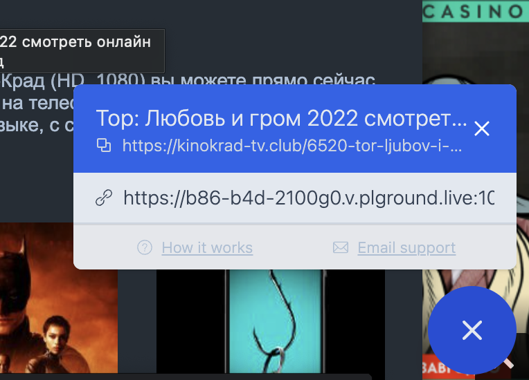
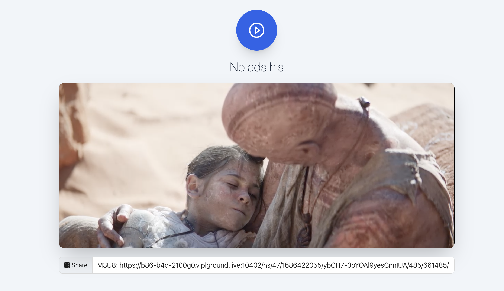

# No ads hls

Watch hls ad-free videos on streaming sites and online cinema without butt-pain and ad blockers! If websites trying load m3u8 file - notification with video link will be appear on right-bottom side.

How to use it: open any video on streaming site(for example - `https://hlsjs.video-dev.org/demo/` goes to `https://noadshls.netlify.app/view/aHR0cHM6Ly90ZXN0LXN0cmVhbXMubXV4LmRldi94MzZ4aHp6L3gzNnhoenoubTN1OA==`) and in right-bottom corner you'll see blue Play icon. Click on it and select playlist from widget!

How to install: 
- Download and unarchive `./extension.md`

- Open `chrome://extensions/` and enable `Developer mode`

- Click on `Load unpacked` and select folder with extension

How to use:
- Open any website with HLS video(`https://hlsjs.video-dev.org/demo` or `https://kinokrad-tv.club/6520-tor-ljubov-i-grom-2022-smotret-online-besplatno.html`)

- Widget will appear in right-bottom corner

- Click on link and watch video without ads
